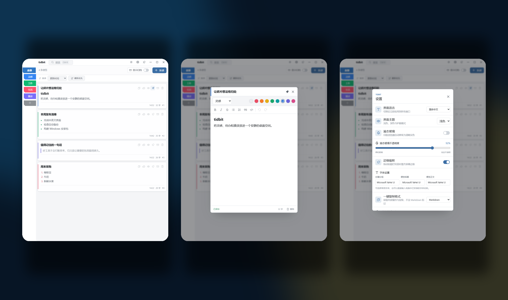
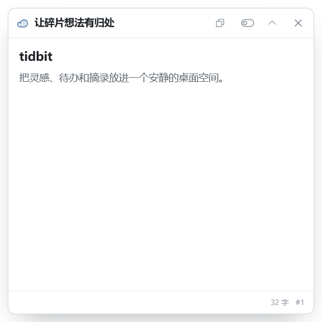

<div align="center">
  

  # tidbit

  **把灵感、待办与摘录，留在一个安静、快速、属于你的桌面空间。**

  一款为 Windows 打造的本地优先桌面便签应用。支持 Markdown、彩色分组、云游便签、自动加密备份与中英文界面。

  [English](./README.en.md) · [下载最新版](https://github.com/Lemostic/tidbit/releases/latest) · [更新日志](./CHANGELOG.md) · [参与贡献](#参与贡献)

  [](./CHANGELOG.md)
  [](https://github.com/Lemostic/tidbit/releases/latest)
  [](https://tauri.app/)
  [](https://github.com/Lemostic/tidbit/actions/workflows/ci.yml)
  [](https://github.com/Lemostic/tidbit/stargazers)
</div>



## 为什么是 tidbit？

`tidbit` 意为“一小段值得记住的信息”。它不想成为另一个庞大的知识库，而是专注于桌面上最自然的记录动作：打开、写下、整理，然后继续工作。

- **本地优先**：便签默认保存在本机，不依赖账号或在线服务。
- **打开即写**：轻量窗口、自定义标题栏、快捷键与托盘常驻，让记录尽可能短路径。
- **不打断思考**：清晰的单列卡片、克制的动效和可完全关闭透明效果的界面。
- **足够强大**：Markdown 编辑、搜索、分组、归档、置顶、云游窗口、加密备份都在一个应用内完成。

## 功能亮点

| | 能力 |
|---|---|
| **Markdown 便签** | 富文本式 Markdown 编辑器，支持标题、列表、引用、代码、粗体、斜体、删除线及统一的卡片渲染。 |
| **彩色分组** | 书签式分组栏，标记色与背景色独立配置；新增分组会避开上一分组的颜色。 |
| **快速整理** | 按名称、创建时间或更新时间排序；支持跨分组拖放、置顶、归档和回收站。 |
| **云游便签** | 把任意便签单独悬浮在桌面，可折叠、调整透明度、只读查看或直接编辑。 |
| **一键复制** | 可选择复制 Markdown，或复制不含 Markdown 标记但保留列表编号与层级的格式化文本。 |
| **窗口能力** | 窗口置顶、边缘吸附、自动隐藏、托盘驻留和隐藏窗口恢复。置顶后不会自动隐藏。 |
| **个性化外观** | 浅色、深色、护眼主题，鲜艳配色，字体分区配置，液态玻璃及 100% 不透明模式。 |
| **隐私与备份** | SQLCipher 数据库、正文隐藏、隐私锁定、AES-256-GCM 加密备份与后台自动轮换。 |
| **中英文界面** | 简体中文和英文即时切换；翻译资源独立存放，方便社区贡献更多语言。 |

## 云游便签

<table>
  <tr>
    <td width="46%" align="center">
      
    </td>
    <td>
      <strong>把当前信息留在眼前，而不是埋进另一个窗口。</strong>
      <br><br>
      云游便签拥有独立桌面窗口，可保持只读、切换编辑、折叠到标题栏并跟随主界面的主题、字体与液态玻璃设置。适合会议提纲、临时任务、代码片段和需要持续对照的资料。
    </td>
  </tr>
</table>

## 下载与安装

前往 [GitHub Releases](https://github.com/Lemostic/tidbit/releases/latest) 下载最新版本：

- `tidbit_*_x64-setup.exe`：推荐，大多数用户选择此 NSIS 安装程序。
- `tidbit_*_x64_en-US.msi`：适合企业部署或需要 MSI 的场景。

运行要求：

- Windows 10 或 Windows 11（x64）
- Microsoft Edge WebView2 Runtime

当前安装包尚未进行商业代码签名，Windows SmartScreen 可能在首次运行时显示提示。请只从本仓库的 Releases 页面下载安装包。

## 快捷键

| 快捷键 | 操作 |
|---|---|
| `Ctrl + K` | 打开搜索与命令面板 |
| `Ctrl + N` | 新建便签 |
| `Ctrl + Shift + N` | 新建分组 |
| `Ctrl + Shift + B` | 立即创建加密备份 |
| `Ctrl + L` | 锁定界面 |
| `Ctrl + ,` | 打开设置 |

## 数据、备份与隐私

- 默认数据目录为 `%APPDATA%\tidbit`，也可以在设置中迁移到自定义目录。
- 数据库使用 SQLCipher 进行静态加密。
- 手动备份和自动备份均为加密快照；自动备份间隔支持 `0.5–24` 小时，步长 `0.5` 小时。
- 自动备份默认保留 `1` 份，最多保留 `10` 份，不会删除手动备份。
- 隐藏便签只遮挡正文，标题仍保留，便于识别；隐藏状态下不能复制正文。
- 隐私锁定用于遮挡当前界面，不应被视为独立的密码管理器或高强度秘密保险箱。

> tidbit 仍处于 `0.1.x` 早期阶段。涉及极高敏感度的数据时，请自行评估风险并保留额外备份。

## 本地开发

### 环境要求

- Windows 10/11
- Node.js 与 pnpm
- Rust stable
- Visual Studio C++ Build Tools
- WebView2 Runtime
- Strawberry Perl（首次编译 vendored OpenSSL 时可能需要）

### 启动项目

```bash
pnpm install
pnpm tauri dev
```

仅调试前端界面：

```bash
pnpm dev
```

完整窗口、托盘、边缘吸附和云游便签必须在 Tauri 环境中验证。

### 质量检查

```bash
pnpm typecheck
pnpm test
cargo test --manifest-path src-tauri/Cargo.toml --lib
```

### 构建安装包

退出正在运行的 `tidbit.exe`，然后执行：

```bash
pnpm tauri build
```

构建结果位于：

- `src-tauri/target/release/bundle/nsis/`
- `src-tauri/target/release/bundle/msi/`

## 技术栈

| 层级 | 技术 |
|---|---|
| 桌面框架 | Tauri 2 |
| 后端 | Rust + Tokio |
| 前端 | React 18 + TypeScript + Vite |
| 编辑器 | Tiptap / ProseMirror |
| 数据库 | SQLCipher / rusqlite |
| 备份加密 | AES-256-GCM + PBKDF2-SHA512 |
| 图标 | Phosphor Icons + tidbit 自有应用图标 |
| 测试 | Vitest + Testing Library + Rust tests |

## 国际化

翻译资源位于：

```text
resources/locales/
├── en/translation.json
├── zh-CN/translation.json
└── README.md
```

新增语言时，请复制一份现有翻译文件、保持键结构一致，并在 `src/i18n/index.ts` 中注册语言。详见 [本地化贡献说明](./resources/locales/README.md)。

## 路线图

- 更稳定、直观的自定义手动排序
- Windows 代码签名与更顺滑的更新体验
- 更完整的导入、导出与备份管理
- 更多语言与社区维护的本地化资源
- 可访问性、性能和键盘操作持续优化

路线图会根据真实使用反馈调整。欢迎通过 [Issues](https://github.com/Lemostic/tidbit/issues) 提交问题和建议。

## 参与贡献

欢迎任何规模的贡献：错误修复、界面优化、文档、测试、翻译和新想法都很有价值。

1. Fork 本仓库并创建功能分支。
2. 保持改动聚焦，并为行为变化补充测试。
3. 运行类型检查和相关测试。
4. 提交 Pull Request，说明动机、实现方式和验证结果。

如果你准备添加较大的功能，建议先创建 Issue 对齐范围，避免重复投入。

## 项目文档

- [更新日志](./CHANGELOG.md)
- [本地化贡献说明](./resources/locales/README.md)

---

<div align="center">
  如果 tidbit 对你有帮助，欢迎点一个 ⭐。<br>
  每一次反馈，都会让这个小小的桌面空间变得更好。
</div>
